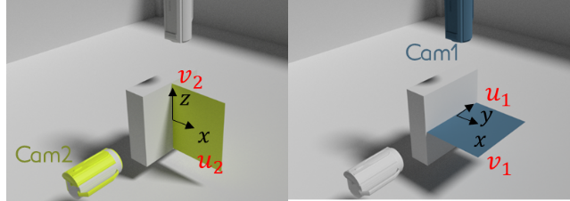
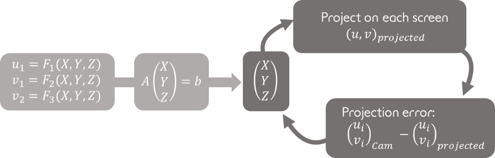
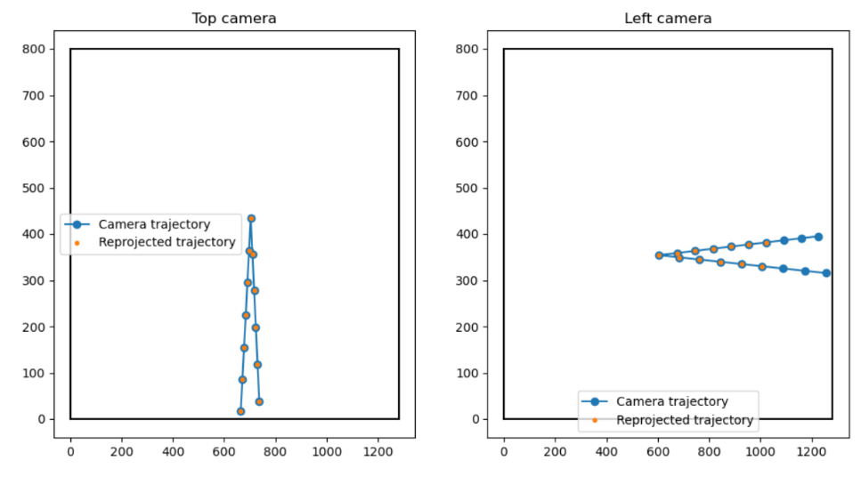

Accounting for perspective
==================================================

Trajectory reconstruction
**************************************************

Perspective is accounted for by using the common pinhole camera model (see the `opencv documentation
<https://docs.opencv.org/2.4/doc/tutorials/calib3d/camera_calibration/camera_calibration.html>`_
for more detail)

First, a camera calibration must be performed for each camera to obtain both the camera intrinsic matrix :math:`F` and the transformation matrix between the camera coordinate system and the sample's coordinate system (CS) :math:`M`

For each camera, the shot 3D coordinates in the sample CS are therefore related by the following relation:

:math:`\begin{bmatrix} s_1 u_1 \\ s_1 v_1 \\ s_1 \end{bmatrix} = F_1 \cdot M_1 \cdot \begin{bmatrix} X \\ Y \\ Z \\ 1 \end{bmatrix},`

:math:`\begin{bmatrix} s_2 u_2 \\ s_2 v_2 \\ s_2 \end{bmatrix} = F_2 \cdot M_2 \cdot \begin{bmatrix} X \\ Y \\ Z \\ 1 \end{bmatrix},`

for camera 1 and 2 respectively. 

The two equations above can therefore be re-written as a linear system with 4 equations for our three unknowns (X,Y and Z).

   
As can be seen in the figure, the two cameras sees approximately the same information toward the x (u1 and v2 coordinates on each camera) coordinate of the shots, one of the above equation can be ignored to obtain a simple linear system with 3 equations and three unknowns

The function :py:func:`data_treat.reconstruction_3d.get_3d_coor` reconstructs the shot 3D trajectory with this method, assuming that the shot position on each camera and the cameras intrinsic and transformation matrices were already obtained.

.. currentmodule:: data_treat.reconstruction_3d
.. autofunction:: get_3d_coor

Using the method "persp", the function only builds the linear system, ignoring on of the four equations and inverts it to get the shot 3D trajectory.

.. note ::
   Usage of high frequency camera often requires to reduce the acquisition resolution to reduce the acquisition time. Since the camera intrinsic and transformation matrices relates the 3D coordinates to the pixel on the screen, the detected coordinates on each screen have to be expressed in the unresized screen frame. This is performed by the function :py:func:`data_treat.reonstruction_3d.cam_shift_resize` which is called automatically in the function :py:func:`data_treat.reonstruction_3d.reconstruct_3d`. The coordinate shift is performed knowing the camera initial and resized resolution provided in the camera objects.

Position optimisation
**************************************************

Slight time delay between the pictures taken by the two cameras can lead to errors in the trajectory estimation as the trajectory will be guessed using two pictures taken at different moments.

To reduce this error, the trajectory of one of the two camera is linearly interpolated to get the pixel coordinate of the shots on the two cameras at the same time.
However, the time delay between the two cameras is difficult to caracterize experimentally. The 'persp-opti' mode of 3D eye finds the values of the camera delay that minimizes the overall projection errors on the two cameras using elast-square optimization (see figure below).

Shot detection and 3D trajectory reconstruction using this method can be performed by calling the function :py:func:`data_treat.reonstruction_3d.reconstruct_3d` with the method attribute set to 'persp' or 'persp-opti'.

.. note: since we interpolate the position value of a camera from t to t+dt, dt being the delay, the first and last detected point will be removed from the analysis as it would require extrapolation.

Error indicators
**************************************************

In addition to being more accurate than the `no-persp` method, the `persp` and `persp-opti` method provides errors indicators on the recovered shot 3D coordinates.
The reprojection error consist in projecting the shot (X,Y,Z) coordinates on each camera and compare it to the initially detected shot position on the screen.
The reprojection is simply performed using the equations above for each camera.

   
The figure above provides an exemple of such reprojection error plot in an ideal case of a perfect camera system modeled in `blender
<https://www.blender.org/>`_ 3D software.

.. raw:: html

    
	

.. role:: blue
.. role:: orange

A bad match between the :orange:`projected points` and the :blue:`detected points` could result from:

1. a bad calibration of either the intrinsic or the transformation matrix: This problem could be solved by taking more chessboard pictures with more various positions, while ensuring the picture quality (see for instance `this link
<https://www.photomodeler.com/kb/taking_proper_images_for_camera_calibrat/>`_ for advices on camera calibration).

2. a bad detection of the shot position on one of the cameras: this could be solved by playing with the shot detection threshold, by using a more sophisticated feature detection algorithm (see for instance `the opencv documentation
<https://docs.opencv.org/3.4/db/d27/tutorial_py_table_of_contents_feature2d.html>`_) or by improving the picture contrast.

It should be noted that this indicator mostly indicates wether the method was well applied or not but not wether the method is relevent for the studied situation.

Reprojection error can be plotted using the :py:func:`data_treat.reconstruction_3d.plot_proj_error` function.

.. currentmodule:: data_treat.reconstruction_3d
.. autofunction:: plot_proj_error

The error will also be plotted when calling :py:func:`data_treat.reconstruction_3d.reconstruct_3d` with the argument `plot` set to `True`.