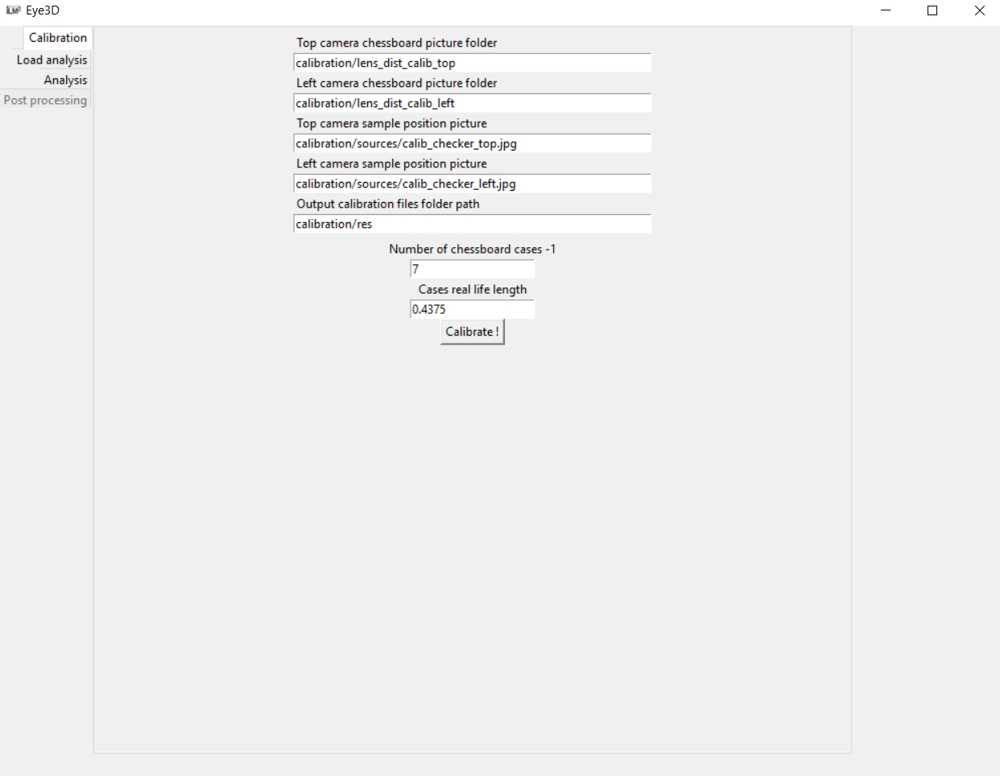
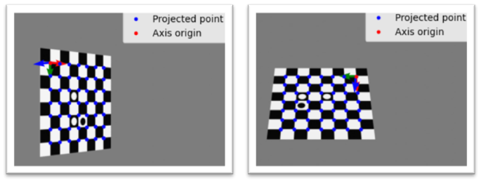

Using the GUI
==================================================

Calibration can be entirely perform using the user interface Calibration tab.

   
The following parameters are required:

* **The top and left cameras chessboard picture folder path** containing several pictures of a chessboard taken with different positions (`.jpg`or `.tif`)
* **The top and left cameras sample position pictures** containing a single picture per camera showing the chessboard in the sample coordinate system, seen by the two cameras simultaneously (`.jpg`or `.tif`).
* **The output calibration folder** where the `cam_top` and `cam_left` calibration files will be saved.
* **The number of chessboard cases -1** 
* **The chess cases length** in cm

After pressing the "Calibrate Button" the interface will display the projection of the chessboard corners and sample coordinate systems on each camera. Ensure that the projected point matches with the corners and that the coordinate systmes are consistent from one camera to another as shown in the picture below.

